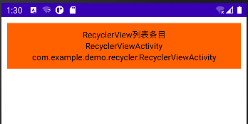

[Android DataBinding 从入门到进阶](https://juejin.cn/post/6844903609079971854)

## 一、在布局中进行数据绑定

### 1.1 在布局中进行数据绑定

```xml
<?xml version="1.0" encoding="utf-8"?>
<layout xmlns:android="http://schemas.android.com/apk/res/android"
    xmlns:tools="http://schemas.android.com/tools">

    <data class="ActivityMainBindTest">

        <import type="com.example.demo.main.ActivityInfo" />

        <variable name="activityInfo" type="com.example.demo.main.ActivityInfo" />

    </data>


    <LinearLayout android:layout_width="match_parent" android:layout_height="match_parent"
        android:orientation="vertical" android:padding="10dp"
        tools:context="com.example.demo.main.MainActivity">

        <LinearLayout android:layout_width="match_parent" android:layout_height="wrap_content"
            android:background="#FF6000" android:gravity="center" android:orientation="vertical"
            android:padding="10dp">

            <TextView android:id="@+id/tv_name" android:layout_width="wrap_content"
                android:layout_height="wrap_content" android:gravity="center"
                android:minWidth="100dp" android:text="@{activityInfo.name}"
                android:textColor="@color/black" />

            <TextView android:id="@+id/tv_activity_name" android:layout_width="wrap_content"
                android:layout_height="wrap_content" android:gravity="center"
                android:minWidth="100dp" android:text="@{activityInfo.activityName}"
                android:textColor="@color/black" />

            <TextView android:layout_width="wrap_content" android:layout_height="wrap_content"
                android:gravity="center" android:minWidth="100dp"
                android:text="@{activityInfo.fullActivityName}" android:textColor="@color/black" />

        </LinearLayout>


    </LinearLayout>
</layout>
```

```java
package com.example.demo.bean;

import androidx.databinding.BaseObservable;

public class ActivityInfo {
    private String name;
    private String activityName;
    private String fullActivityName;

    public String getName() {
        return name;
    }

    public void setName(String name) {
        this.name = name;
    }

    public String getActivityName() {
        return activityName;
    }

    public void setActivityName(String activityName) {
        this.activityName = activityName;
    }

    public String getFullActivityName() {
        return fullActivityName;
    }

    public void setFullActivityName(String fullActivityName) {
        this.fullActivityName = fullActivityName;
    }
}

```

```java
package com.example.demo;

import android.os.Bundle;
import android.os.Handler;
import android.view.View;

import androidx.annotation.Nullable;
import androidx.appcompat.app.AppCompatActivity;
import androidx.databinding.DataBindingUtil;

import com.example.demo.main.ActivityInfo;
import com.example.demo.recycler.RecyclerViewActivity;
import com.example.widget.R;
import com.example.widget.databinding.ActivityMainBindTest;

public class MainActivity extends AppCompatActivity {

    ActivityInfo activityInfo;

    @Override
    protected void onCreate(@Nullable Bundle savedInstanceState) {
        super.onCreate(savedInstanceState);
        setContentView(R.layout.activity_main);
        //设置页面
        activityInfo = new ActivityInfo();
        activityInfo.setName("RecyclerView列表条目");
        activityInfo.setActivityName(RecyclerViewActivity.class.getSimpleName());
        activityInfo.setFullActivityName(RecyclerViewActivity.class.getName());
        ActivityMainBindTest activityMainBinding = DataBindingUtil.setContentView(this, R.layout.activity_main);
        activityMainBinding.setActivityInfo(activityInfo);
    }
}

```



### 1.2 为布局中的按钮添加点击事件

```xml
<?xml version="1.0" encoding="utf-8"?>
<layout xmlns:android="http://schemas.android.com/apk/res/android"
    xmlns:tools="http://schemas.android.com/tools">

    <data class="ActivityMainBindTest">

        <import type="com.example.demo.main.ActivityInfo" />

        <import type="com.example.demo.main.MainActivity.ActivityInfoHandler" />

        <variable name="activityInfo" type="ActivityInfo" />

        <variable name="activityInfoHandler" type="ActivityInfoHandler" />

    </data>


    <LinearLayout android:layout_width="match_parent" android:layout_height="match_parent"
        android:orientation="vertical" android:padding="10dp"
        tools:context="com.example.demo.main.MainActivity">

        <LinearLayout android:layout_width="match_parent" android:layout_height="wrap_content"
            android:background="#FF6000" android:gravity="center" android:orientation="vertical"
            android:padding="10dp">

            <TextView android:id="@+id/tv_name" android:layout_width="wrap_content"
                android:layout_height="wrap_content" android:gravity="center"
                android:minWidth="100dp" android:text="@{activityInfo.name}"
                android:textColor="@color/black" />

            <TextView android:id="@+id/tv_activity_name" android:layout_width="wrap_content"
                android:layout_height="wrap_content" android:gravity="center"
                android:minWidth="100dp" android:text="@{activityInfo.activityName}"
                android:textColor="@color/black" />

            <TextView android:layout_width="wrap_content" android:layout_height="wrap_content"
                android:gravity="center" android:minWidth="100dp"
                android:text="@{activityInfo.fullActivityName}" android:textColor="@color/black" />

            <Button android:layout_width="match_parent" android:layout_height="wrap_content"
                android:onClick="@{()->activityInfoHandler.changeOnlyProperty()}"
                android:text="修改单一属性" android:textAllCaps="false" />

            <Button android:layout_width="match_parent" android:layout_height="wrap_content"
                android:onClick="@{()->activityInfoHandler.changeAllProperty()}"
                android:text="修改全部属性" android:textAllCaps="false" />
        </LinearLayout>


    </LinearLayout>
</layout>
```

```java
package com.example.demo;

import android.os.Bundle;
import android.util.Log;

import androidx.annotation.Nullable;
import androidx.appcompat.app.AppCompatActivity;
import androidx.databinding.DataBindingUtil;

import com.example.demo.main.ActivityInfo;
import com.example.demo.recycler.RecyclerViewActivity;
import com.example.widget.R;
import com.example.widget.databinding.ActivityMainBindTest;

public class MainActivity extends AppCompatActivity {

    ActivityInfo activityInfo;
    ActivityInfoHandler activityInfoHandler;

    @Override
    protected void onCreate(@Nullable Bundle savedInstanceState) {
        super.onCreate(savedInstanceState);
        setContentView(R.layout.activity_main);
        //设置页面
        activityInfo = new ActivityInfo();
        activityInfo.setName("RecyclerView列表条目");
        activityInfo.setActivityName(RecyclerViewActivity.class.getSimpleName());
        activityInfo.setFullActivityName(RecyclerViewActivity.class.getName());
        activityInfoHandler = new ActivityInfoHandler();
        ActivityMainBindTest activityMainBinding = DataBindingUtil.setContentView(this, R.layout.activity_main);
        activityMainBinding.setActivityInfo(activityInfo);
        activityMainBinding.setActivityInfoHandler(activityInfoHandler);
    }

    public class ActivityInfoHandler {

        public void changeOnlyProperty() {
            Log.d("ActivityInfoHandler", "changeOnlyProperty方法被执行");
        }

        public void changeAllProperty() {
            Log.d("ActivityInfoHandler", "changeAllProperty方法被执行");
        }

    }


}
```

日志信息：

```cmd
2022-05-15 21:55:06.260 10724-10724/com.example.widget D/ActivityInfoHandler: changeOnlyProperty方法被执行
2022-05-15 21:55:10.571 10724-10724/com.example.widget D/ActivityInfoHandler: changeAllProperty方法被执行
```

