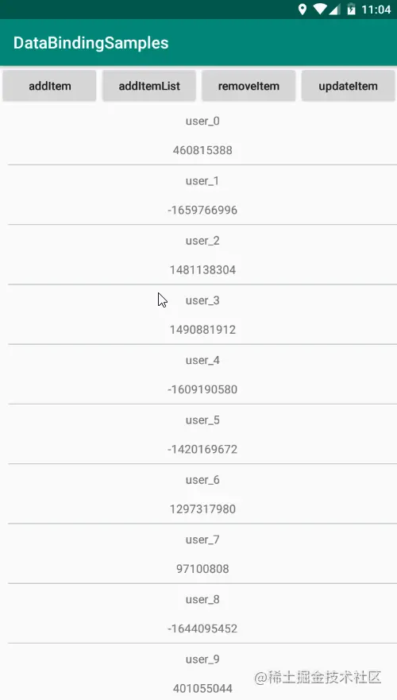

https://juejin.cn/post/6844903784284422152

## 与 RecyclerView 搭配使用

```xml
<?xml version="1.0" encoding="utf-8"?>
<layout xmlns:android="http://schemas.android.com/apk/res/android">

    <data>

        <import type="leavesc.hello.databindingsamples.model.User" />

        <variable name="user" type="User" />

    </data>

    <LinearLayout android:layout_width="match_parent" android:layout_height="wrap_content"
        android:orientation="vertical" android:paddingLeft="10dp">

        <TextView android:id="@+id/tvName" android:layout_width="match_parent"
            android:layout_height="wrap_content" android:gravity="center" android:padding="8dp"
            android:text="@{user.name}" />

        <TextView android:id="@+id/tvPassword" android:layout_width="match_parent"
            android:layout_height="wrap_content" android:gravity="center" android:padding="8dp"
            android:text="@{user.password}" />

        <View android:layout_width="match_parent" android:layout_height="1dp"
            android:background="#c6cdd4" />

    </LinearLayout>

</layout>

```

对应的适配器

```java
public class UserAdapter extends RecyclerView.Adapter<UserAdapter.UserAdapterHolder> {

    private List<User> userList;

    public UserAdapter(List<User> userList) {
        this.userList = userList;
    }

    @NonNull
    @Override
    public UserAdapterHolder onCreateViewHolder(@NonNull ViewGroup parent, int viewType) {
        ItemUserBinding binding = DataBindingUtil.inflate(LayoutInflater.from(parent.getContext()), R.layout.item_user, parent, false);
        return new UserAdapterHolder(binding);
    }

    @Override
    public void onBindViewHolder(@NonNull UserAdapterHolder holder, int position) {
        holder.getBinding().setUser(userList.get(position));
    }

    @Override
    public int getItemCount() {
        if (userList == null) {
            return 0;
        }
        return userList.size();
    }

    class UserAdapterHolder extends RecyclerView.ViewHolder {

        private ItemUserBinding binding;

        UserAdapterHolder(ItemUserBinding binding) {
            super(binding.getRoot());
            this.binding = binding;
        }

        public ItemUserBinding getBinding() {
            return binding;
        }
    }

}

```

## 二、RecyclerView Adapter 高效率刷新

前文讲到了 ObservableList ，此处就可以通过 ObservableList 的实现类 ObservableArrayList 来实现 RecyclerView Adapter
的高效刷新，而不是每次都是直接 notifyDataSetChanged 可以先看下 ObservableArrayList 的源码，可以发现在每次增删改数据时，都会触发到
ListChangeRegistry 内的 OnListChangedCallback 回调，且 OnListChangedCallback
是把每次改动到的数据位置都给透传到外部，我们可以通过这些信息来只刷新 Adapter 的特定位置，从而实现高效刷新，并且获得一些动画效果

```java
public class ObservableArrayList<T> extends ArrayList<T> implements ObservableList<T> {

    private transient ListChangeRegistry mListeners = new ListChangeRegistry();

   	···

    @Override
    public boolean add(T object) {
        super.add(object);
        notifyAdd(size() - 1, 1);
        return true;
    }

    @Override
    public void clear() {
        int oldSize = size();
        super.clear();
        if (oldSize != 0) {
            notifyRemove(0, oldSize);
        }
    }

    @Override
    public T remove(int index) {
        T val = super.remove(index);
        notifyRemove(index, 1);
        return val;
    }

    @Override
    public T set(int index, T object) {
        T val = super.set(index, object);
        if (mListeners != null) {
            mListeners.notifyChanged(this, index, 1);
        }
        return val;
    }

    private void notifyAdd(int start, int count) {
        if (mListeners != null) {
            mListeners.notifyInserted(this, start, count);
        }
    }

    private void notifyRemove(int start, int count) {
        if (mListeners != null) {
            mListeners.notifyRemoved(this, start, count);
        }
    }
    
    ···

}

```

此处通过 DynamicChangeCallback 来实现对 Adapter 的刷新操作

````java
public class DynamicChangeCallback<T> extends ObservableList.OnListChangedCallback<ObservableList<T>> {

    private RecyclerView.Adapter adapter;

    public DynamicChangeCallback(RecyclerView.Adapter adapter) {
        this.adapter = adapter;
    }

    @Override
    public void onChanged(ObservableList<T> sender) {
        adapter.notifyDataSetChanged();
    }

    @Override
    public void onItemRangeChanged(ObservableList<T> sender, int positionStart, int itemCount) {
        adapter.notifyItemRangeChanged(positionStart, itemCount);
    }

    @Override
    public void onItemRangeInserted(ObservableList<T> sender, int positionStart, int itemCount) {
        adapter.notifyItemRangeInserted(positionStart, itemCount);
    }

    @Override
    public void onItemRangeMoved(ObservableList<T> sender, int fromPosition, int toPosition, int itemCount) {
        adapter.notifyItemRangeRemoved(fromPosition, itemCount);
        adapter.notifyItemRangeInserted(toPosition, itemCount);
    }

    @Override
    public void onItemRangeRemoved(ObservableList<T> sender, int positionStart, int itemCount) {
        adapter.notifyItemRangeRemoved(positionStart, itemCount);
    }

}

````

通过几个按钮来分别测试 Adapter 的数据刷新情况

```java
public class Main13Activity extends AppCompatActivity {

    private ObservableArrayList<User> userObservableArrayList;

    @Override
    protected void onCreate(Bundle savedInstanceState) {
        super.onCreate(savedInstanceState);
        setContentView(R.layout.activity_main13);
        RecyclerView rvList = findViewById(R.id.rvList);
        rvList.setLayoutManager(new LinearLayoutManager(this));
        initData();
        UserAdapter userAdapter = new UserAdapter(userObservableArrayList);
        userAdapter.notifyDataSetChanged();
        userObservableArrayList.addOnListChangedCallback(new DynamicChangeCallback(userAdapter));
        rvList.setAdapter(userAdapter);
    }

    private void initData() {
        userObservableArrayList = new ObservableArrayList<>();
        for (int i = 0; i < 20; i++) {
            User user = new User("user_" + i, String.valueOf(new Random().nextInt() * 4));
            userObservableArrayList.add(user);
        }
    }

    public void addItem(View view) {
        if (userObservableArrayList.size() >= 3) {
            User user = new User("user_" + 100, String.valueOf(new Random().nextInt() * 4));
            userObservableArrayList.add(1, user);
        }
    }

    public void addItemList(View view) {
        if (userObservableArrayList.size() >= 3) {
            List<User> userList = new ArrayList<>();
            for (int i = 0; i < 3; i++) {
                User user = new User("user_" + 100, String.valueOf(new Random().nextInt() * 4));
                userList.add(user);
            }
            userObservableArrayList.addAll(1, userList);
        }
    }

    public void removeItem(View view) {
        if (userObservableArrayList.size() >= 3) {
            userObservableArrayList.remove(1);
        }
    }

    public void updateItem(View view) {
        if (userObservableArrayList.size() >= 3) {
            User user = userObservableArrayList.get(1);
            user.setName("user_" + new Random().nextInt());
            userObservableArrayList.set(1, user);
        }
    }

}

```

